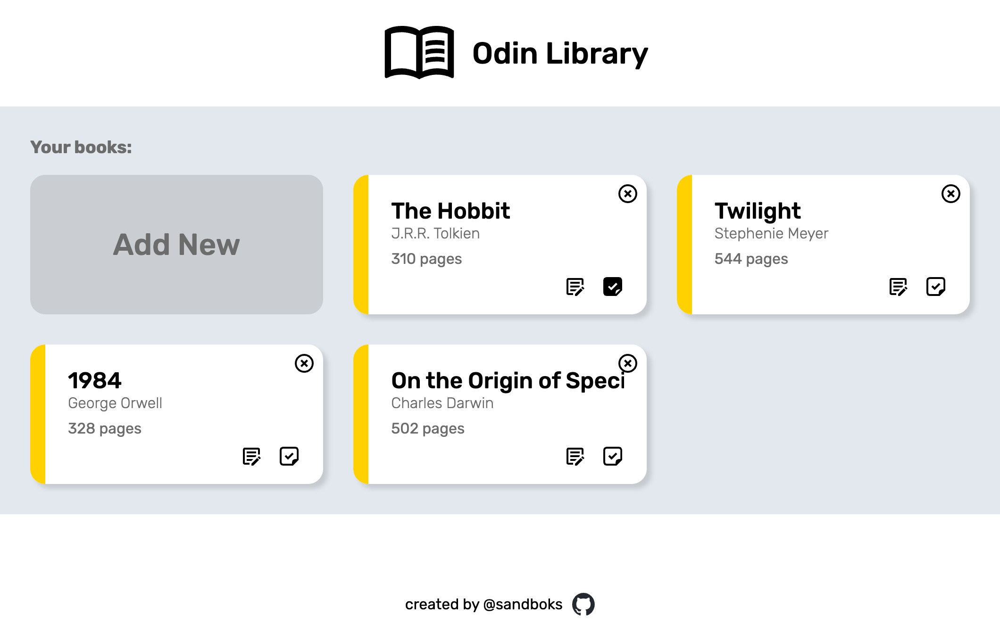

# ACCESS HERE:
https://sandboks.github.io/odin-library/

# ASSIGNMENT SPEC:
https://www.theodinproject.com/lessons/node-path-javascript-library

# PREVIEW

# FEATURES
- Create, edit and track books in your own personal library
- Grid layout that responsively adjusts to the size of your browser (mobile not supported)

Tested with Google Chrome. Other browsers should work as expected.

# credits
Material design icons taken from here:
https://pictogrammers.com/library/mdi/

Layout inspired by this project:
https://luciavu.github.io/library/